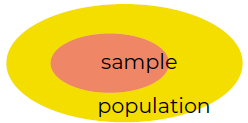

# Module 1 - basic concepts and sampling

## The scientific method
Hoe leren we dingen  
| Niet-wetenschappelijk | Wetenschappelijk |
| :--- | :--- |
| Gut feeling | Er zijn al zoveel planeten ... |
| Iemand anders zegt ... | Moleculen om te leven zijn overal |
| Gelezen op het internet! | Nog geen bewijs, maar wel logisch redeneren |

Empirical research
- Exploration
- Description
- Prediction
- Verification

Generalization - Understanding  

## The research process
1. Problem statement → What is the research question?
2. Define exact information needs → What exactly do we need to measure?
3. Perform research → Surveys, simulations, experiments, ...
4. Processing data → Statistical software
5. Analyzing data → Statistical methods
6. Formulate conclusions → Write a research report

## Basic concepts in research

### Variables and values
Variable = eigenschap ve object  
Value = specifieke eigenschap, interpretatie voor de variabele  
vb. variable = gender → value = male, female, ...

### Measurement levels
= variable types  
Meest passende methode voor analyse bepalen: visualisatie, afwijking, relatie tussen var, ...

 
\pagebreak 

| Qualitatief | Quantitatief |
| :--- | :--- |
| Niet altijd numeriek | Nummer + unit of measurement |
| Beperkt aantal waarden | Veel mogelijke waarden, soms uniek |
|| Bevatten vaak resultaat van een meting |

Qualitatief  
- Nominaal: categorieën → gender, country, shape, ...  
- Ordinaal: order, rank → level of education, military rank, ...  

Quantitatief  
- Interval: geen vast nulpunt, geen proportions → °C, °F, ...  
- Ratio: absoluut nulpunt, proportions → afstand (m), energy (J), gewicht (kg), ...  

### Relations between variables
→ variabelen zijn gerelateerd als hun waarden systematisch veranderen  
Voorbeeld: verband tussen type cola en appreciatie?
- Geen goed voorbeeld: andere hoeveelheden voor pepsi en cc
- Ander beeld, maar zelfde appreciatie

||Pepsi|Coca cola|Total|
|:---|:---|:---|:---|
|Like|56|24|80|
|Dislike|14|6|20|
|Total|70|30|100|

### Causal relationships
Voorbeeld
- Frustratie leidt tot agressie
- Alcohol leidt tot lagere alertheid

Cause: onafhankelijke variabele  
Consequence: afhankelijke variabele

Valse causale relaties: Spurious correlations
! Relatie tussen variabele is niet altijd een causale relatie
Voorbeeld: gewelddadige videogames leiden niet altijd tot agressief gedrag

 
\pagebreak 

## Sample testing
Population: collection van alle objecten/mensen/... die je wilt onderzoeken  
Sample: subset vd populatie die onderzocht gaan worden  
→ soms: resultaten van sample representatief voor populatie  

Sampling method
- Vastleggen populatie
- Sampling frame bepalen
- Sampling methode kiezen (budget en tijd)

### Hoe elementen kiezen voor een sample?
Random: elk element vd populatie heeft even veel kans om in sample te zitten  
Non-random: elementen die makkelijk verzameld kunnen worden hebben meer kans → convenience sampling  

### Mogelijke errors
- Accidental ↔ systematic
- Sampling error ↔ non-sampling error

Sampling errors
- Accidental sampling errors: coincidence
- Systematic sampling errors
  - Online survey: uitgesloten zonder internet
  - Street survey: enkel mensen die daar dan zijn
  - Voluntary survey: alleen geïnteresseerden

Non-sampling errors
- Accidental non-sampling errors: verkeerd aangeduide antwoorden
- Systematic non-sampling errors
  - Slecht gekalibreerde meet-apparatuur
  - Waarde beïnvloed
  - Testpersonen liegen