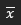
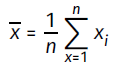
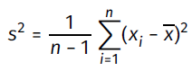
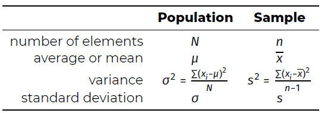
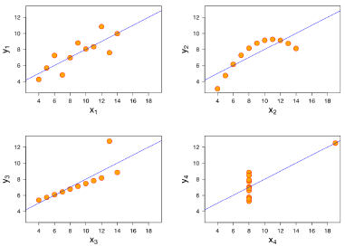

# Module 2 - univariate statistics

## Central tendency and dispersion

### Measure of central tendency → welke waarde is representatief voor hele groep?
<b> Mean or average </b>  
Arithmetic mean = sum of all values divided by the number of values →   
Formule:   
→ gevoelig voor uitschieters
  

<b> Median </b>  
Waarden soorten, middenste getal kiezen  
- Even aantal getallen: middenste
- Oneven aantal getallen: gemiddelde van middenste 2  

Voorbeeld: 141, 198, 143, 201, 184 → 141, 143, 184, 198, 201 → median = 184
 

<b> Mode </b>  
Getal dat het vaakst voorkomt in de dataset

### Measures of dispersion → hoe groot zijn de verschillen in de groep?
<b> Range </b>  
Absolute verschil tussen hoogste en laagste waarde vd dataset
 

<b> Quartiles </b>  
Quartielen ve gesorteerde set van numbers zijn 3 waarden die de set in 4 even grote delen verdeelt  
Uitvoering
- lengte is even: mediaan nemen, en dan mediaan van linkse helft, en mediaan van rechtse helft
- lengte is oneven: mediaan is gemiddelde van middenste 2 waardes, en dan mediaan van linkse helft, en mediaan van rechtse helft
 

<b> Variance and standard deviation </b>  
Variance: s² of o²: gemiddeld verschil tussen data en wiskundig gemiddelde  
Formule:   

Standard deviation: s of o: vierkantswortel van variance  
Slide 17 (vragen hierover)
 

<b> Belangrijk! </b>  
- Enkel waarde geven is niet genoeg!
- Extra data nodig om mensen te kunnen laten interpreteren

### Short summary

#### Central tendency and dispersion
|Measurement level|Center|Spread distribution|
| :--- | :--- | :--- |
|Qualitative|Mode|-|
|Quantitative|Average/mean, median|Variance, standard deviation, range, interquartile range|

#### Symbols

## Data visualisation

### Chart types
|Measurement level|Chart type|
| :--- | :--- |
|Qualitative|Bar chart|
|Quantitative|Boxplot, histogram, density plot|

### Pie chart
- Beperkt gebruik
- Nadelen: hoeken vergelijken is lastig, hoe meer categorieën → onduidelijker

### Interpretation of charts
Tips
- Assen benoemen
- Duidelijke titel
- Eenheid benoemen

Data distortion  
= data verkeerd presenteren zodat ongeldige conclusies worden genomen
- Schaal misleidend
- Niet te veel randtekeningen
- Verminder 'ink to data' ratio

Illustratie: Anscombe's quartet zijn 4 verschillende datasets met dezelfde metingen voor central tendency en dispersion  
