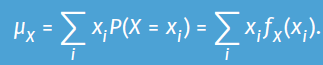
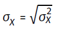

# Module 3. The central limit theorem, hypothesis testing

## Probability distribution of a sample

### Probability
Informeel: probabiliteit = kans dat iets gebeurt bij bepaald experiment  
Formeel: probabiliteit = relatieve frequentie van een gebeurtenis adhv een experiment  

Example: met dobbelsteen gooien; kans op een 1, op een even nummer, ...  

Dus
- Probabiliteit zijn nummers toegewezen aan een set
- Deze set zijn deel van het 'universe', genoteerd als Ω  
- Probabiliteiten moeten voldoen aan 3 regels om overeen te komen met wat onze intuïtie vindt dat probabiliteiten zich moeten 'gedragen'  

### Axioms (rules) of probability
1. Probabilities zijn niet-negatief: P(A) ≥ 0 voor elke A  
2. Universe heeft probabiliteit 1= P(Ω) = 1  
3. Als A en B onafhankelijk zijn (dus A ∩ B = ø) dan: P(A ∪ B) = P(A) + P(B) → somregel  

### Properties of probabilities
1. Complement-regel: voor elke A kan: P(Ã) = 1 - P(A) waar à = gebeurtenis voorstelt dat A niet gebeurt  
2. Onmogelijke gebeurtenis heeft kans nul: P(ø) = 0  
3. Algemene som-regel: P(A ∪ B) = P(A) + P(B) - P(A ∩ B)

### Independent events  
= ene gebeurtenis verandert niet als andere gebeurt  
Definitie: Wiskundig, zijn 2 events A en B onafhankelijk als: P(A ∩ B) = P(A) * P(B)

Voorbeeld bepalen (on)afhankelijk  
- Situatie: PlayStation (PS), Nintendo Switch (NS), of beide
- A: student heeft PS, B: student heeft NS
- Hier: P(A) = 200/250 = 0.8 en P(B) = 100/250 = 0.4
- P(A) * P(B) = 0.8 * 0.4 = 0.32 en P(A ∩ B) = 75/250 = 0.3 ≠ 0.32
- Dus: P(A ∩ B) ≠ P(A) * P(B) → afhankelijk

### Random variable
Voorbeeld: je krijgt geld bij trekken van bepaalde kaart  
  

Door regels van probabiliteit kunnen we hier kansen bijzetten:  
  

Waarbij altijd: f(0) + f(1) + f(2) + f(3) = 1 en ook 0 ≤ f(x) ≤ 1

Zelfde voorbeeld kan bij gooien van som 8 met 2 dobbelstenen → 2+6, 3+5, 4+4, 5+3, 6+2 → 5 op 36 kansen  

Als je probability distribution function hebt: andere probabilities berekenen
- Minstens ...
- Voorbeeld: minstens €2 verdienen met eerder genoemde spel

  

**Expectation of a random variable**: als een persoon een spel heel vaak uitvoert, wat zou het gemiddelde zijn

Definitie:   

**Variance of a RV**: a measure of dispersion that resembles the sample variance very closely  
Definitie:   

Standard deviation:   

**Continuous RV**
- Soms heeft variabele een (ontelbaar) oneindig aantal uitkomsten
- Geen nut om kans op een nummer exact te stellen, beter met intervallen: x tussen [a,b]  
→ probability density function

Continuous uniform RV  
  

- P(1 < x < 1.5) = 0.5 * 0.5 = 0.25
- P(1 < x < 1.5) = P(1 < x ≤ 1.5) = P(1 ≤ x < 1.5) = P(1 ≤ x ≤ 1.5) → en ook: P(0 ≤ x ≤ 2) = 1

**Expectation and variance**  
Voor continuous RV: formules voor expectation en variance
- Expectation:   
- Variance:   

slide 34 - 36

## From sample to population

